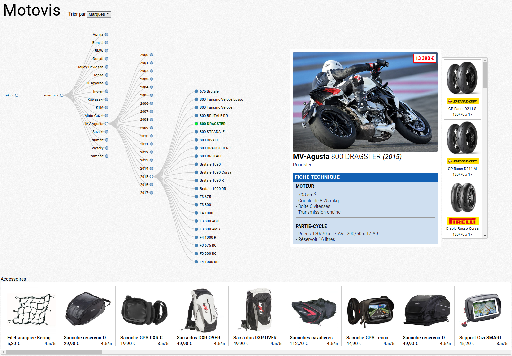

# Motovis
> Motorbikes data visualiser



## Prerequisites:
  - `MongoDB`
  - `Node.js`
  - `npm`
  - `Scrapy`
    - `pymongo`

## Usage:
### Install
##### Clone the GitHub repo:
```bash
git clone https://github.com/yboyer/motovis.git
cd motovis
```
##### Install dependencies:
```bash
npm i
```
### Fill the MongoDB database
#### From the dump
##### Restore data With `mongorestore`:
```
mongorestore
```
#### With Scrapy
##### Crawl data of websites:
```bash
cd crawler
python core.py
```
_or with individual spider_
```bash
scrapy crawl [dafy | motoblouz | motoplanete]
```
### Run
##### Run server and start listening on port `3000`
```bash
npm start
```
